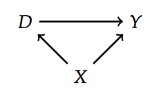

```{r setup, include=FALSE}
options(htmltools.dir.version = FALSE)
knitr::opts_chunk$set(warning = FALSE, message = FALSE, 
  comment = NA, dpi = 300, echo = FALSE, cache = F,
  fig.align = "center", out.width = "90%", fig.asp = 0.618)
```

```{r packages}
library(tidyverse)
library(magrittr)
library(here)
library(colorspace)
library(patchwork)

```

```{r xaringan-themer, include=FALSE}
library(xaringanthemer)
duo(
  primary_color = "#ffffff",
  secondary_color = "#2a488e",
  # secondary_color = "#4671d6",
  # text_color = "#2C3E50",
  header_font_google = google_font("Josefin Sans"),
  text_font_google   = google_font("Montserrat", "300", "300i"),
  code_font_google   = google_font("Droid Mono"),
  text_font_size = "25px", 
  text_slide_number_font_size = "0.0em"
)
```

# Materials

- [Chapter in Scott Cunningham's free *Mixtape* textbook](http://scunning.com/cunningham_mixtape.pdf)

---

class: middle

```{r}
knitr::include_graphics("https://media.giphy.com/media/bg6nsqSbbEXDi/giphy.gif")
```

---

## What are DAGs?

-  ~~A turd hanging off the rear end of a sheep (caught in the fleece)~~

---

## What are DAGs?

- A way of modeling causal effects using *graphs*

- Model is represented by a set of *nodes* and *edges*

- Describes all causal pathways, but also where causal pathways *don't* exist

---
class: middle

.pull-left[
### DAG with a *confounder* X
```{r}

```
]

--

### Two paths from D to Y

.pull-right[

- D &rarr; Y **(direct path)**

- D &larr; X &rarr; Y **(backdoor path)**

]

---

